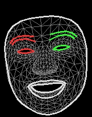

# Multi-Purpose Hand, Body, Face, Face Mesh, and Sign Language Tracking using MediaPipe and OpenCV




This GitHub repository contains a Python script for real-time multi-purpose tracking using the MediaPipe library and OpenCV. The script captures video from the webcam and employs various MediaPipe modules for comprehensive tracking and analysis of hand, body, face, face mesh, and even simple sign language gestures.

## Prerequisites

Make sure you have the following libraries installed in your Python environment:

- OpenCV (cv2)
- MediaPipe (mediapipe)
- NumPy (numpy)

You can install them using the following command:

```
pip install opencv-python mediapipe numpy
```

## Features

### Real-time Hand Tracking
The script uses the MediaPipe Hands module to detect and track landmarks on the hands. It precisely identifies finger joints and palm landmarks for accurate hand motion analysis.

### Body Pose Estimation
Integrated with the MediaPipe Pose module, the script estimates both 2D and 3D poses of human bodies. This provides insights into body posture, orientation, and joint angles.

### Face Detection
Leveraging the MediaPipe Face Detection module, the script detects faces within the video frames. It provides bounding box coordinates for detected faces.

### Face Mesh Tracking
Using the MediaPipe Face Mesh module, the script performs real-time tracking of facial landmarks with high precision. This includes points around eyes, eyebrows, nose, lips, and other facial features.

### Sign Language Detection
The script includes custom logic to detect simple sign language gestures based on tracked hand landmarks. It interprets specific hand configurations to recognize predefined sign language signs or gestures.

### Hand Handedness Detection
The script identifies whether the detected hand is the left or right hand. This information is displayed on the video frames, providing context for the hand tracking data.

### Body Pose and Face Landmark Visualization
The script visualizes tracked body poses and face landmarks using the MediaPipe Drawing Utilities module. It displays lines connecting the landmarks, providing a clear representation of the tracked features.

### Frames per Second (FPS) Calculation
The script calculates and displays the frames per second (FPS) rate on the video frames. This metric helps gauge the performance of the tracking system and the overall efficiency of the script.

## Controls

- Press 'q' to exit the application.

## Credits

- This project utilizes the MediaPipe library, developed by Google, which forms the backbone of the tracking functionalities.
- The code for hand, body, face, face mesh, and sign language tracking and visualization is based on the provided code.

## License

This project is licensed under the MIT License - see the [LICENSE](LICENSE) file for details.

Feel free to contribute, modify, and use this code as needed. If you encounter any issues or have suggestions for improvement, please open an issue in the GitHub repository.

## Usage

1. Install the required libraries using the provided prerequisites.
2. Run the script, and the webcam feed will open showing the various tracking features.
3. Interact with the webcam to observe real-time tracking of hands, body pose, face, face mesh, and sign language gestures.
4. To exit the application, press the 'q' key.

## Future Enhancements

Stay tuned for more updates and enhancements to our multi-purpose tracking script! We are continuously working to expand the capabilities of the script to provide even more insightful tracking and analysis.

---
```

You can copy and paste this markdown into your repository's README file. Make sure to replace the image paths and URLs with the actual ones from your project.
